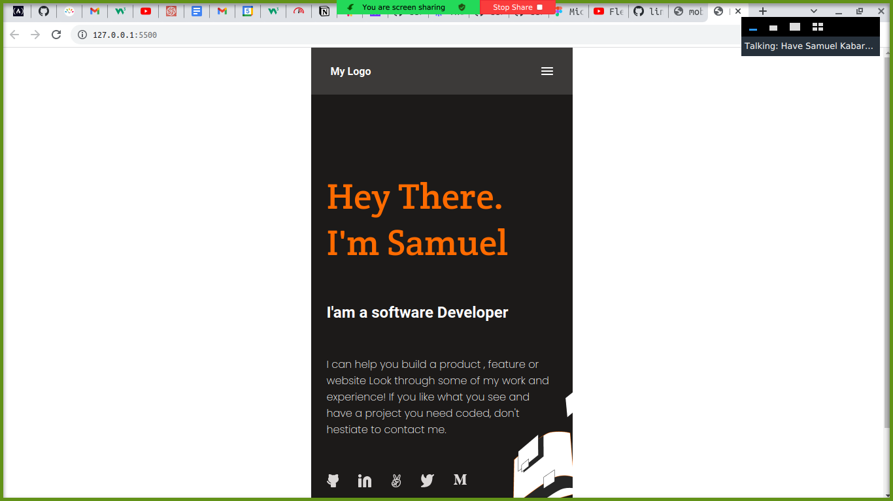

# Portfolio: setup and mobile version skeleton

> This is my fast page of the Portfolio.



This is the screenshot of my page

## Built With

- HTML & CSS
- Git and Github
- Linters

## Live Demo

[Live Demo Link](https://have-samuel.github.io/portfolio1/)


## Getting Started

To get a local copy up and running follow these simple example steps.

### Prerequisites
Have Git  installed correctly.

### setup
open the terminal and install the copy of the repository.

### Install
Use the commad below to get a copy:
```
git clone git@github.com:Have-Samuel/portfolio1.git
```
### Usage
Make any necessary editing.
## Authors

👤 **Have-Samuel**
- GitHub: [@githubhandle](https://github.com/Have-Samuel)
- Twitter: [@twitterhandle](https://twitter.com/home)
- LinkedIn: [LinkedIn](https://www.linkedin.com/feed/)

## 🤝 Contributing

Contributions, issues, and feature requests are welcome!

Feel free to check the [issues page](../../issues/).

## Show your support

Give a ⭐️ if you like this project!

## Acknowledgments

- Thanks Microverse for the guidlines.

## 📝 License

This project is [MIT](./MIT.md) licensed.
